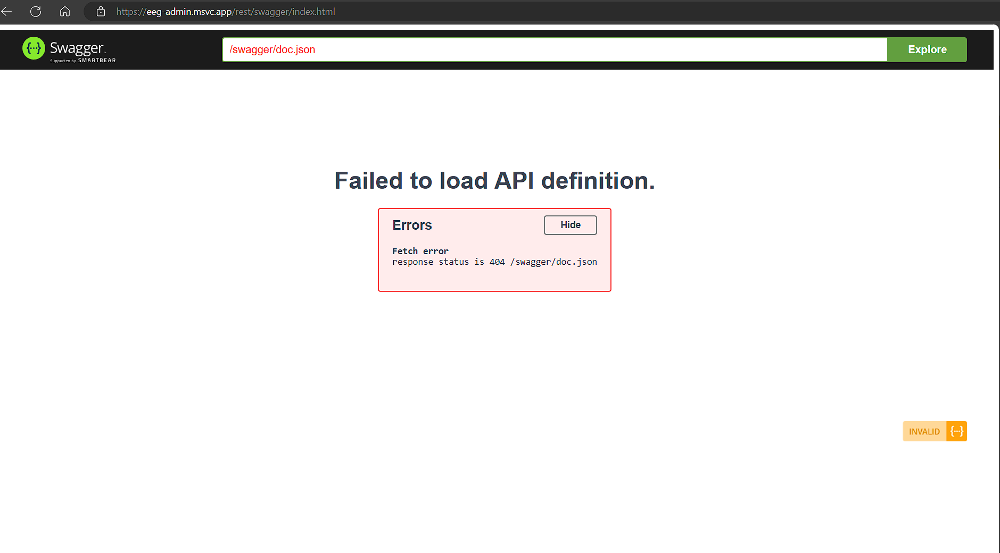
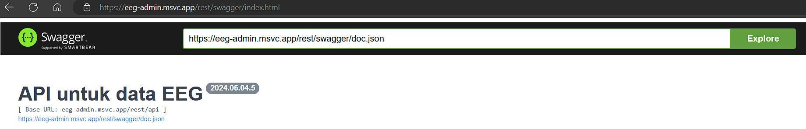

# Penjelasan Penggunaan Endpoint

Akses Swagger-UI di [sini](https://eeg-admin.msvc.app/rest/swagger/index.html) untuk mencoba endpoint-endpoint yang ada.

Nanti akan muncul error seperti pada gambar berikut:


Untuk itu, masukkan `https://eeg-admin.msvc.app/rest/swagger/doc.json` pada kolom isian `Explore` di bagian atas halaman. Nanti akan menjadi seperti gambar ini:


Kemudian klik `Explore` dan akan muncul daftar endpoint yang bisa digunakan.
Silakan bisa mulai mencoba endpoint-endpoint yang ada.

## Ping
### GET `/api/ping`
ini digunakan untuk mengecek apakah server berjalan atau tidak

## Bayi
Endpoint-endpoint yang berhubungan dengan data bayi
### POST `/api/newborn-data`
digunakan untuk menambahkan data bayi baru. Request body berupa JSON dengan format:
```json
{
  "accel_x": 0,
  "accel_y": 0,
  "accel_z": 0,
  "gravidity": 0,
  "mother_age": 0,
  "mother_name": "string",
  "name": "string",
  "parity": 0,
  "spo_2": 0,
  "thermal": 0,
  "trial_code": "string"
}
```
- `accel_x`, `accel_y`, `accel_z` merupakan data akselerasi bayi. 
- `gravidity` merupakan jumlah kehamilan ibu. 
- `mother_age` merupakan umur ibu. 
- `mother_name` merupakan nama ibu. 
- `name` merupakan nama bayi. 
- `parity` merupakan jumlah anak yang pernah lahir. 
- `spo_2` merupakan data oksigenasi bayi. 
- `thermal` merupakan data suhu bayi. 
- `trial_code` merupakan kode uji coba.

Untuk `trial_code` ini, harus sama dengan nanti yang ada di inputan pada endpoint `/api/newborn-eeg` karena inilah yang akan menghubungkan data bayi dengan data EEG bayi.

### POST `/api/newborn-eeg`
digunakan untuk menambahkan data EEG bayi baru. Request body berupa JSON dengan format:
```json
{
  "channel": "string",
  "trial_code": "string",
  "value": 0
}
```

- `channel` merupakan channel EEG bayi.
- `trial_code` merupakan kode uji coba.
- `value` merupakan nilai EEG bayi.

Perhatikan aturan untuk `trial_code` ya.

## Ibu Hamil
Endpoint-endpoint yang berhubungan dengan data ibu hamil
### POST `/api/pregnant-data`
digunakan untuk menambahkan data ibu hamil baru. Request body berupa JSON dengan format:
```json
{
  "age": 0,
  "diastole": 0,
  "fetal_hr": 0,
  "gravidity": 0,
  "hr": 0,
  "name": "string",
  "parity": 0,
  "resp_count": 0,
  "sistole": 0,
  "spo_2": 0,
  "trial_code": "string"
}
```

- `age` merupakan umur ibu hamil.
- `diastole` merupakan data diastole ibu hamil.
- `fetal_hr` merupakan data detak jantung janin.
- `gravidity` merupakan jumlah kehamilan ibu.
- `hr` merupakan data detak jantung ibu.
- `name` merupakan nama ibu hamil.
- `parity` merupakan jumlah anak yang pernah lahir.
- `resp_count` merupakan data hitungan napas ibu hamil.
- `sistole` merupakan data sistole ibu hamil.
- `spo_2` merupakan data oksigenasi ibu hamil.
- `trial_code` merupakan kode uji coba.

Aturan untuk `trial_code` sama seperti di endpoint bayi (tapi tidak harus sama dengan kode uji coba pada data bayi).

### POST `/api/pregnant-eeg`
digunakan untuk menambahkan data EEG ibu hamil baru. Request body berupa JSON dengan format:
```json
{
  "channel": "string",
  "trial_code": "string",
  "value": 0
}
```

- `channel` merupakan channel EEG ibu hamil.
- `trial_code` merupakan kode uji coba.
- `value` merupakan nilai EEG ibu hamil.

Perhatikan aturan untuk `trial_code` ya.